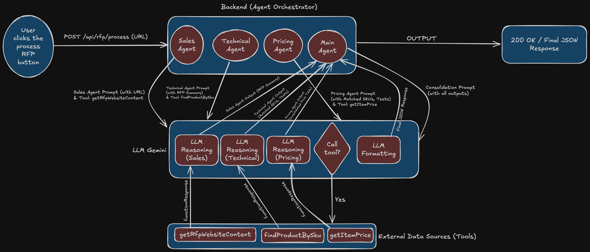

# RFP AI Agent

An intelligent Request for Proposal (RFP) processing system that uses AI agents to analyze tenders, match products, and generate pricing quotes for a wires and cables company.



## 🎯 Overview

The RFP AI Agent is a multi-agent system that automates the entire RFP analysis workflow:

1. **Sales Agent** - Scans and identifies relevant RFPs with upcoming deadlines
2. **Technical Agent** - Analyzes product requirements and recommends matching SKUs
3. **Pricing Agent** - Generates comprehensive pricing tables with tests and products
4. **Main Agent** - Consolidates all information into a structured response

## 🏗️ Architecture

```
ey2026/
├── backend/                 # Node.js/TypeScript backend
│   ├── src/
│   │   ├── agents/         # AI agent implementations
│   │   ├── routes/         # API endpoints
│   │   ├── services/       # External service integrations (Gemini AI)
│   │   └── tools/          # Data processing utilities
│   └── data/               # CSV data files (products, pricing)
└── frontend/               # React/TypeScript frontend
    └── src/                # Frontend application code
```

## 🚀 Features

- **Automated RFP Analysis**: Intelligent parsing of tender documents and websites
- **Product Matching**: SKU recommendation based on technical specifications
- **Dynamic Pricing**: Real-time price lookup for products and testing services
- **Multi-Agent Workflow**: Specialized agents for different aspects of RFP processing
- **Structured Output**: JSON-formatted responses for easy integration

## 🛠️ Technology Stack

### Backend

- **Runtime**: Node.js with TypeScript
- **AI/ML**: Google Gemini API
- **Web Framework**: Express.js
- **Data Processing**: CSV parsing, Cheerio for web scraping
- **Environment**: dotenv for configuration

### Frontend

- **Framework**: React with TypeScript
- **Build Tool**: Vite
- **Styling**: CSS modules

## 📋 Prerequisites

- Node.js (v16 or higher)
- npm or yarn
- Google AI API key (for Gemini)

## ⚙️ Installation

### 1. Clone the repository

```bash
git clone https://github.com/sdass1918/RFP-AI-Agent.git
cd RFP-AI-Agent
```

### 2. Backend Setup

```bash
cd backend
npm install
```

### 3. Environment Configuration

Create a `.env` file in the backend directory:

```env
GOOGLE_API_KEY=your_gemini_api_key_here
PORT=3000
```

### 4. Frontend Setup

```bash
cd ../frontend
npm install
```

## 🚀 Running the Application

### Start Backend Server

```bash
cd backend
npm run dev
```

The backend will run on `http://localhost:3000`

### Start Frontend Development Server

```bash
cd frontend
npm run dev
```

The frontend will run on `http://localhost:5173`

## 📊 Data Files

The system uses CSV files for product and pricing data:

- `backend/data/products.csv` - Product catalog with SKUs and specifications
- `backend/data/pricing.csv` - Pricing information for products and tests
- `backend/data/sampleRfpWebsite.html` - Sample RFP document for testing

## 🔧 API Endpoints

### RFP Processing

- `POST /api/rfp/process` - Process RFP and generate complete analysis

Example response:

```json
{
  "rfpSummary": "Summary of identified RFP requirements",
  "technicalSolution": "Product recommendations and specifications",
  "priceQuote": "Detailed pricing breakdown"
}
```

## 🤖 Agent Workflow

1. **Sales Agent**

   - Scans RFP websites for relevant opportunities
   - Identifies deadlines and requirements
   - Prioritizes most urgent RFPs

2. **Technical Agent**

   - Analyzes technical specifications
   - Matches requirements to product catalog
   - Creates specification comparison tables

3. **Pricing Agent**

   - Retrieves pricing for recommended products
   - Includes testing costs
   - Generates comprehensive pricing tables

4. **Main Agent**
   - Consolidates all agent outputs
   - Formats final JSON response
   - Ensures data consistency

## 📁 Project Structure

### Backend

```
backend/src/
├── agents/
│   └── mainAgent.ts        # Multi-agent orchestration
├── routes/
│   └── rfpRoutes.ts        # API route definitions
├── services/
│   └── gemini.ts           # Google Gemini AI integration
├── tools/
│   ├── dataQueryTools.ts   # CSV data processing
│   └── webAndFileTools.ts  # Web scraping utilities
└── index.ts                # Application entry point
```

### Frontend

```
frontend/src/
├── components/             # React components
├── assets/                 # Static assets
├── App.tsx                 # Main application component
└── main.tsx               # Application entry point
```

## 🔒 Security Considerations

- API keys are stored in environment variables
- Input validation for all API endpoints
- CORS configuration for frontend-backend communication
- No sensitive data in version control

## 📝 Development

### Adding New Products

Update `backend/data/products.csv` with new SKUs and specifications.

### Adding New Pricing

Update `backend/data/pricing.csv` with current pricing information.

### Extending Agents

Modify `backend/src/agents/mainAgent.ts` to add new agent capabilities or workflow steps.

---

Check the console output for detailed execution logs during development.
